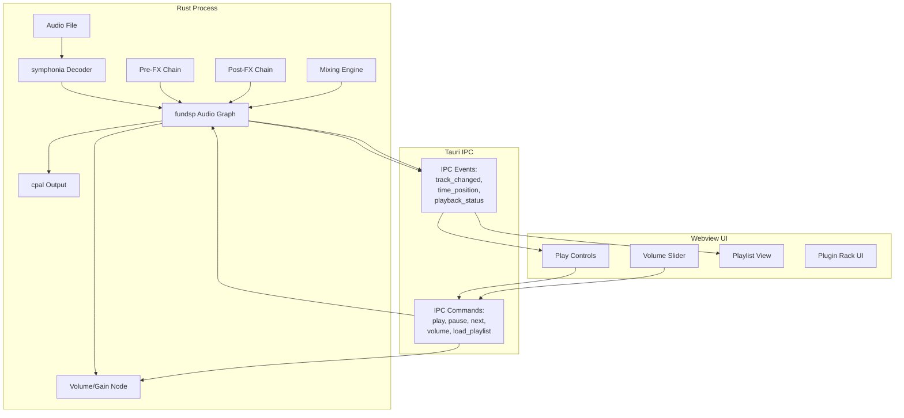

## ADR-001: Audio Pipeline in Rust

* **Status:** Accepted
* **Date:** 2026-07-07
* **Author:** Architect

### Context

The audio player needs to decode multiple formats (MP3, WAV, FLAC), process audio through a configurable DSP graph (mixing, effects), and output to system audio devices. Two approaches were considered:

**Option A — Web Audio in Webview:** Decode in Rust, send PCM buffers via Tauri IPC to the webview, run the processing graph using Web Audio API nodes, and output to the sound card from the browser context.

**Option B — Audio entirely in Rust:** Decode (symphonia), process (fundsp graph), and output (cpal) all in Rust. The webview sends only lightweight control commands via Tauri IPC.

Option B was chosen. The primary driver is that Option A would push uncompressed PCM audio data across the Tauri IPC boundary continuously during playback — a 44.1kHz stereo 16-bit stream is ~176 KB/s, but with buffering and real-time requirements this creates nontrivial latency and bandwidth concerns. Furthermore, the Web Audio API's audio graph is less flexible than fundsp for custom DSP compositions, and the WASM plugin system (ADR-002) would need to run inside AudioWorklets, which have significant restrictions on module loading and import capabilities.

### Decision

We will run the entire audio pipeline in Rust: use `symphonia` for decoding, `fundsp` for the audio processing graph, and `cpal` for audio output. The webview will be a pure UI layer communicating exclusively via Tauri IPC commands (play, pause, volume set, load playlist, etc.) and receiving state update events (current track, time position, playback status).

### Visual Architecture

### Consequences

**Positive (Benefits):**
- No audio data crosses the Tauri IPC boundary — only lightweight control messages (bytes, not megabytes per second).
- fundsp provides a pull-based graph that composes naturally for mixing, pre/post processing, and volume control.
- cpal gives direct OS-level audio output with device change handling.
- Lower end-to-end latency for real-time audio processing.
- The WASM plugin system (ADR-002) runs in wasmtime inside the same process, avoiding AudioWorklet restrictions.

**Negative (Risks/Trade-offs):**
- All audio processing code is in Rust, raising the barrier for contributors who only know TypeScript.
- Debugging audio issues requires Rust tooling (gdb, lldb) rather than browser DevTools.
- fundsp's pull model creates an impedance mismatch with WASM plugins' push model, requiring an adapter node.

**Neutral/Mitigations:**
- A well-defined IPC contract between Rust and the webview must be documented as the single source of truth for the UI layer.
- The audio processing graph should expose a debug/visualization mode for development.
