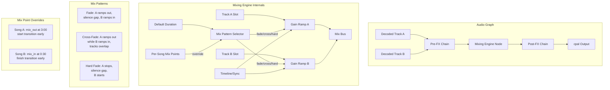

## ADR-005: Mixing Engine Architecture

* **Status:** Accepted
* **Date:** 2026-07-07
* **Author:** Architect

### Context

The audio player must support transitions between consecutive tracks with multiple mix patterns (fade, cross-fade, hard fade). Users should be able to define per-song mix-in and mix-out points that override the default transition behavior — this is the feature that differentiates this player from typical music players. The mixing engine must integrate with the fundsp audio graph between the pre-fx and post-fx chains.

The mixing engine introduces stateful behavior: during a transition, two tracks are active simultaneously with time-varying gains. This is inherently different from single-track playback and requires careful handling of timing, gain ramps, and track overlap.

### Decision

The mixing engine will be implemented as a fundsp node that sits between the pre-fx chain and the post-fx chain in the audio graph. It will manage two internal playback slots (current track and next track) with configurable mix patterns and durations. Per-song mix-in/mix-out points are stored in the playlist JSON and read by the engine when preparing a transition. The engine supports fade (gain ramp out, then ramp in), cross-fade (overlapping gain ramps), and hard fade (silence gap) patterns. The default mix pattern and duration are configurable in the application settings.

### Visual Architecture

### Consequences

**Positive (Benefits):**
- Per-song mix points enable DJ-like transitions (e.g., start cross-fading during a song's outro).
- Multiple mix patterns give users creative control over how tracks flow together.
- Integration as a fundsp node means the engine composes naturally with pre/post processing chains.
- Default configuration provides sensible behavior while mix points offer fine-grained control when desired.

**Negative (Risks/Trade-offs):**
- The mixing engine requires two simultaneous decode streams during transitions, doubling memory and CPU usage at transition boundaries.
- Mix point timing requires precise sample-accurate tracking — clock drift between decode streams must be managed.
- Hard fade with a silence gap is trivial but cross-fade requires overlapping playback with synchronized sample clocks.
- Per-song mix points add complexity to the playlist format and the UI (timeline editing).

**Neutral/Mitigations:**
- Pre-decode the next track's first buffer at transition time to minimize seek latency.
- Use a shared sample clock reference for both decode streams to prevent drift.
- The UI timeline/waveform view for setting mix points should snap to zero-crossings or beat grids if feasible.
- Consider a "preview transition" mode that lets users audition mix points before saving.
